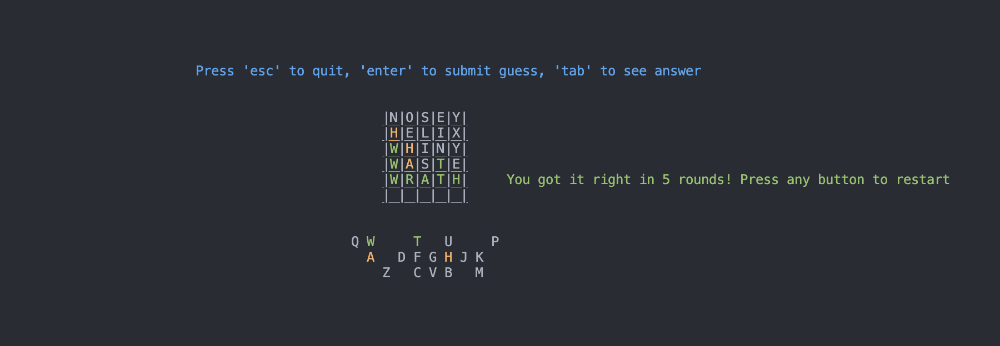

# A Python Wordle

This program uses all in-built Python packages, no need for a virtual environment.

## Installation
Clone repo
```
git clone git@github.com:mjkgarrow/python-wordle.git
```

Play game
```
python3 wordle.py
```

## How to play

Press 1 to use official Wordle words, the default is a list of more common 5-letter words.

Guess the word in 6 tries.

Each guess must be a valid 5-letter word.
The color of the tiles will change to show how close your guess was to the word.



Green - means the letter is in the word and in the correct spot.

Orange - means the letter is in the word but in the wrong spot.

Grey - means the letter is not in the word in any spot.

## Word usage

The `words.txt` file is sourced from Donald E. Knuth's [The Stanford GraphBase: A Platform for Combinatorial Computing](https://www-cs-faculty.stanford.edu/~knuth/sgb.html), found [here](https://www-cs-faculty.stanford.edu/~knuth/sgb-words.txt). It contains 5,757 common 5-letter words.

The `words_long.txt` file is a list of the currently used words in the official [Wordle](https://www.nytimes.com/games/wordle/index.html) app. It contains 14,855 words and is a fair bit harder.